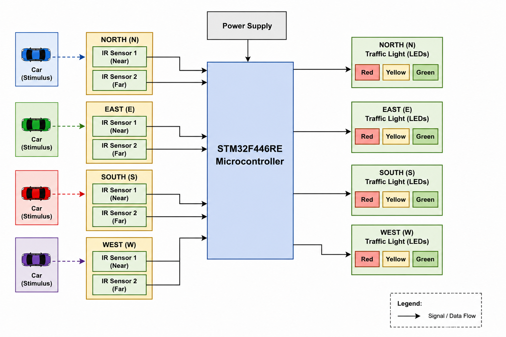
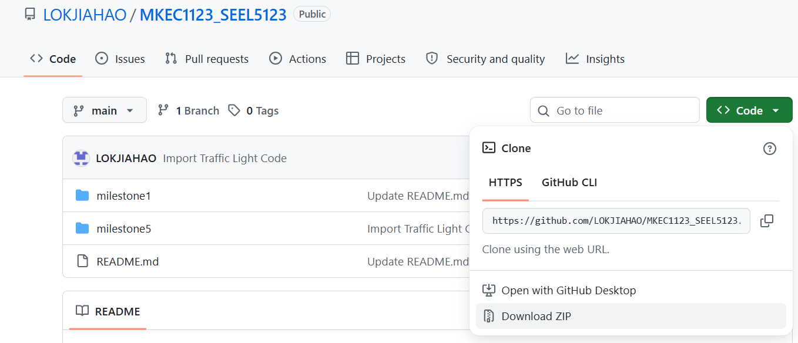

# Milestone 5: Smart Adaptive Traffic Light System 

## Project Overview
This repository contains the complete firmware code and project files for a four-way junction Smart Adaptive Traffic Light System. The system utilizes an STM32 microcontroller and IR sensors to dynamically adjust green light durations based on real-time traffic flow. It features embedded decision-making algorithms that prioritize heavy traffic lanes while ensuring fairness via an anti-starvation protocol.



---

## Hardware and Software Used
* Microcontroller: STM32 NUCLEO-F446RE
* Sensors: 8x Infrared (IR) Sensors (2 per lane for density estimation)
* Actuators: 12x LEDs (Red, Yellow, Green for 4 directions)
* Connection: Mini-USB cable
* IDE/Toolchain: STM32CubeIDE and STM32CubeMX

---

## Software Setup: Importing and Running the Project

### Step 1: Download the Repository

You can download the project to your local machine using either of the two methods below:

#### Option 1: Download as a ZIP File
1. Scroll to the top of this GitHub repository page.
2. Click the green **Code** button.
3. Select **Download ZIP** from the dropdown menu.
4. Extract the downloaded ZIP folder on your computer.

Refer to the image below for guidance:



#### Option 2: Clone Using Git
If you have Git installed, open your terminal or command prompt, navigate to your desired workspace folder, and run the following command:

```bash
git clone https://github.com/LOKJIAHAO/MKEC1123_SEEL5123.git
```

### Step 2: Import into STM32CubeIDE

Once you have downloaded or cloned the repository files, follow these steps to open the project:

1. Open your file manager and navigate to the project folder:
   **`MKEC1123_SEEL5123-main/milestone5/AdaptiveTrafficLight/`**
2. Double-click the **`.project`** file.
3. STM32CubeIDE will launch automatically.
4. Choose your workspace.
5. The project will be imported to your workspace.
6. The [`main.c`](/milestone5/AdaptiveTrafficLight/Core/Src/main.c) file is located in the generated `Src` folder.

### Step 3: Build and Flash

1. Ensure your STM32 NUCLEO-F446RE board is connected to your PC via the Mini-USB cable.
2. Click the Build button (hammer icon) in the top toolbar to compile the main.c firmware.
3. Click the Debug/Run button (green play bug icon) to flash the compiled firmware onto the board.
4. (Optional) Open a Serial Terminal (like Tera Term or PuTTY) and connect to the board's COM port at a baud rate of 115200 to view real-time traffic classification and debugging logs.

---

## Hardware Setup: Pin Connections
To replicate the physical prototype, the hardware must be wired exactly as configured in the STM32 pinout. Below is the pin mapping derived from the main.c setup.

### LED Outputs (Traffic Lights)
All LEDs should be connected to the specified pins with an appropriate current-limiting resistor (e.g., 220 Ohm or 330 Ohm) to GND.

| Direction | Red LED Pin | Yellow LED Pin | Green LED Pin |
| -------- | -------- | -------- | -------- |
| North | PA6 | PA7 | PA8 |
| East | PB2 | PB3 | PB4 |
| South | PC2 | PC3 | PC4 |
| West | PC7 | PC8 | PC9 |


### IR Sensor Inputs (Traffic Detection)
IR sensors require 5V or 3.3V power (depending on module specs) and a connection to GND. Connect their digital output pins as follows:

| Direction | Sensor 1 (Stop-Line) | Sensor 2 (Far-Back) |
| -------- | -------- | -------- |
| North | PA0 | PA1 |
| East | PB0 | PB1 |
| South | PC0 | PC1 |
| West | PC5 | PC6 |

---

## Demonstration Video
[Milestone6](https://youtu.be/XwWDksAelKQ)
